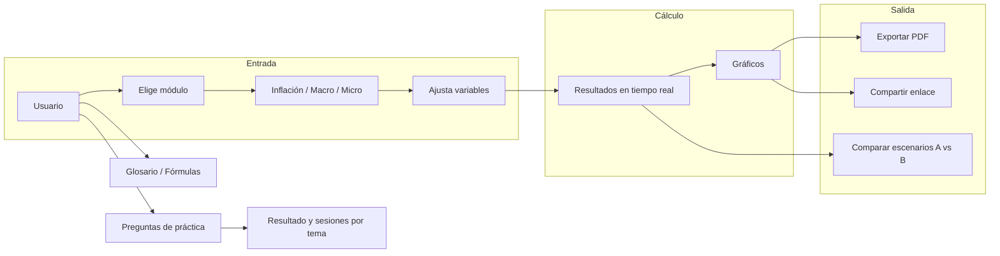
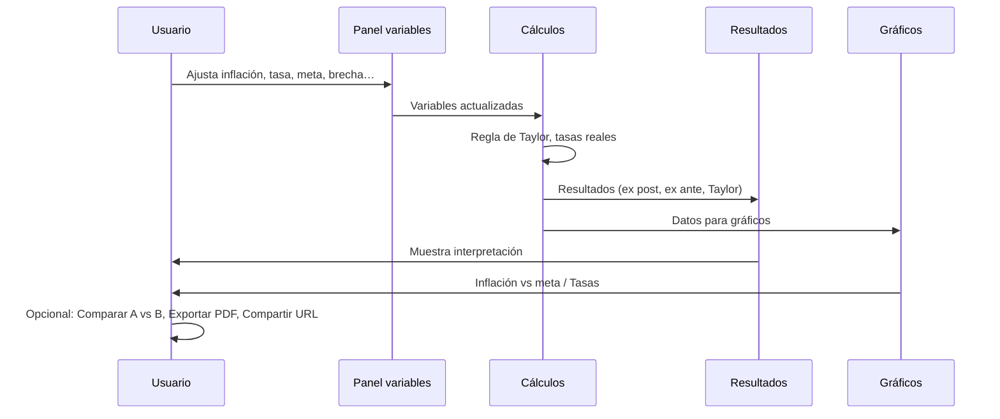

<p align="center">
  
</p>

<h1 align="center">Econosfera</h1>
<p align="center">
  <strong>Herramienta didáctica</strong> de inflación y política monetaria, macroeconomía y microeconomía.
</p>
<p align="center">
  Simuladores interactivos, referencias académicas y prácticas para estudiantes y docentes.
</p>

---

## Contenido

- [Qué es Econosfera](#qué-es-econosfera)
- [Flujo de la aplicación](#flujo-de-la-aplicación)
- [Módulos y funcionalidades](#módulos-y-funcionalidades)
- [Cómo usar](#cómo-usar)
- [Despliegue](#despliegue)
- [Tecnologías](#tecnologías)
- [Estructura del proyecto](#estructura-del-proyecto)
- [Citar y más](#citar-y-más)

---

## Qué es Econosfera

Econosfera es una **aplicación web** pensada para clases de economía: permite simular escenarios de **inflación y política monetaria**, **macroeconomía** (multiplicador keynesiano) y **microeconomía** (oferta y demanda, elasticidad). Incluye datos de referencia por país (México, EE.UU., Europa), fuentes oficiales (Banxico, INEGI), referencias académicas, glosario, fórmulas, preguntas de práctica y opciones para **exportar a PDF** y **compartir enlace** con el escenario cargado.

Los conceptos y definiciones se basan en fuentes como Banxico, CEMLA, El Trimestre Económico e Investigación Económica (UNAM).

---

## Flujo de la aplicación



**Flujo por módulo (Inflación):**



---

## Módulos y funcionalidades

| Módulo | Contenido |
|--------|------------|
| **Inflación** | Variables (inflación, tasa de política, meta, brecha de producto, tipo de política). Resultados: tasa real ex post/ex ante, brechas, tasa de Taylor, desviación. Gráficos. Comparador de escenarios A vs B. Exportar PDF y enlace con parámetros. Fuentes Banxico/INEGI y referencias académicas. |
| **Macroeconomía** | Simulador del multiplicador keynesiano (PMC, gasto público, impuestos). Conceptos y fórmulas. Referencias y preguntas de práctica. |
| **Microeconomía** | Oferta y demanda (lineal), equilibrio, elasticidad, excedentes. Simulador interactivo. Referencias y preguntas de práctica. |
| **Glosario** | Definiciones de términos económicos con base en fuentes citadas. |
| **Fórmulas** | Fórmulas por área (inflación, macro, micro) con notación clara. |

**Extras:**

- **Preguntas de práctica**: 10 preguntas por tema (inflación, macro, micro); al finalizar se muestra el resultado y se pueden completar sesiones por tema.
- **Comparar escenarios**: Dos conjuntos de supuestos (A y B) con resultados y gráfico comparativo.
- **Exportar / compartir**: PDF con resumen del escenario; URL con parámetros para abrir el simulador con valores ya cargados.
- **Cómo citar**: En el pie de página, citas en formato APA, Chicago y BibTeX.
- **Datos por país**: México, EE.UU., Europa y “Principales” para cargar variables de referencia.
- **Referencias académicas**: Listas por módulo (≥15 por área) con UNAM (bidi, eTESIUNAM) y autores/instituciones mexicanas.

---

## Cómo usar

### Desarrollo

```bash
npm install
npm run dev
```

Abre [http://localhost:3000](http://localhost:3000). Si falta el build, `npm run dev` ejecuta antes un build automático.

### Producción

```bash
npm run build
npm start
```

### Scripts útiles

| Comando | Descripción |
|---------|-------------|
| `npm run dev` | Servidor de desarrollo (con predev que asegura el build) |
| `npm run build` | Compilación para producción |
| `npm run start` | Sirve la app compilada |
| `npm run clean` | Borra `.next` y `node_modules/.cache` |
| `npm run fresh` | `clean` + `build` (reinicio limpio) |
| `npm run lint` | Linter |

**Si ves errores** tipo `Cannot find module './174.js'` o `middleware-manifest.json`: ejecuta `npm run fresh` y luego `npm run dev`.

---

## Despliegue

**Sitio en vivo:** [https://econosfera.vercel.app/](https://econosfera.vercel.app/)

El proyecto está listo para [Vercel](https://vercel.com):

1. Conecta el repositorio desde Vercel (Import).
2. Vercel detecta Next.js y usa `npm run build` por defecto.
3. Despliega.

Opcional: variable de entorno `NEXT_PUBLIC_SITE_URL` (ej. `https://tudominio.com`) para Open Graph y citas. Si no la defines, se usa `VERCEL_URL`.

---

## Tecnologías

- **Next.js 14** (App Router)
- **TypeScript**
- **Tailwind CSS**
- **Recharts** (gráficos)
- **jsPDF** (exportar PDF)

---

## Estructura del proyecto

```
├── public/           # Logo, favicon, assets estáticos
├── src/
│   ├── app/          # Rutas (page, layout, aviso-privacidad, terminos)
│   ├── components/   # UI: simuladores, gráficos, glosario, exportar, etc.
│   └── lib/          # Lógica: cálculos, tipos, preguntas, fuentes, países
├── scripts/
│   └── ensure-build.js   # Asegura build antes de dev (middleware-manifest)
├── next.config.js
├── tailwind.config.ts
└── package.json
```

---

## Citar y más

- **Citar la herramienta**: En el pie de la web, “Cómo citar esta herramienta” con formatos APA, Chicago y BibTeX (y botón copiar). URL de referencia: [https://econosfera.vercel.app/](https://econosfera.vercel.app/).
- **Publicidad (AdSense)**: El sitio puede mostrar anuncios; configuración vía variables de entorno (ver `.env.example`). Sin configurar se muestran placeholders.
- **Aviso**: Herramienta de apoyo al análisis. No sustituye el criterio profesional ni las proyecciones oficiales del banco central.

---

<p align="center">
  
</p>
<p align="center">
  <sub>Econosfera · Herramienta didáctica</sub>
</p>
