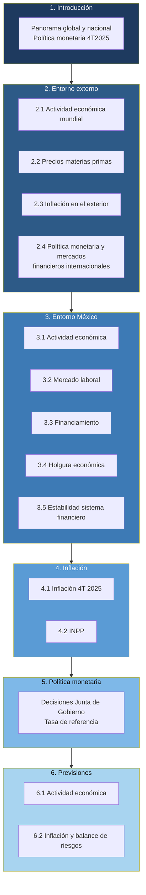
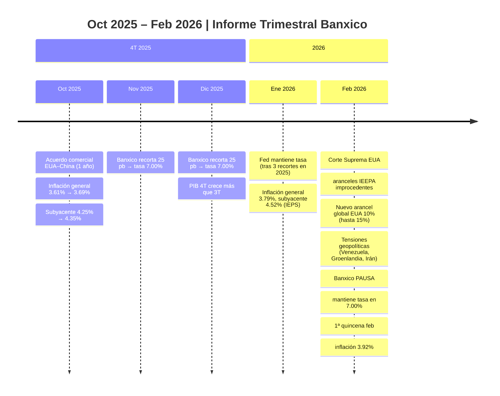
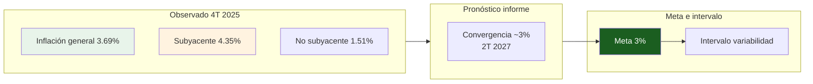
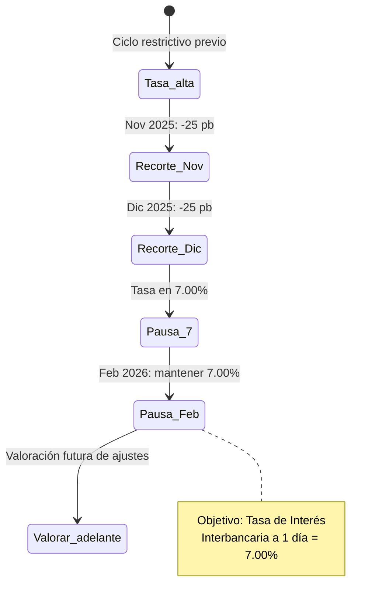
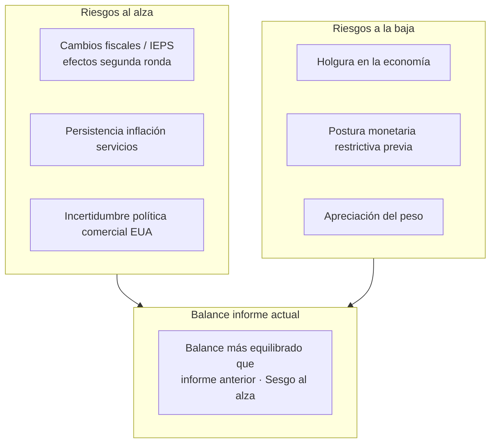
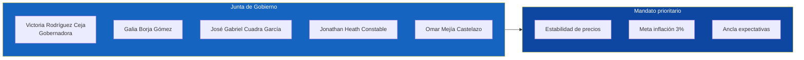

# Resumen visual – Informe Trimestral Banxico (Oct–Dic 2025)

**Documento:** Informe Trimestral, Octubre–Diciembre 2025  
**Publicado:** 26 de febrero de 2026  
**Fuente:** [Banco de México](https://www.banxico.org.mx/publicaciones-y-prensa/informes-trimestrales/informes-trimestralesprecios.html)

---

## 1. Estructura del informe (mapa de contenidos)



---

## 2. Línea de tiempo: decisiones y contexto (4T 2025 – feb 2026)



---

## 3. Inflación y meta (trayectoria conceptual)



---

## 4. Política monetaria: ciclo de recortes y pausa



---

## 5. Entorno global → México (flujo de riesgos)

```mermaid
flowchart TB
    subgraph global["Entorno global"]
        G1[Tensiones comerciales<br/>EUA–China, aranceles]
        G2[Conflictos geopolíticos]
        G3[Actividad mundial: ritmo<br/>ligeramente menor]
        G4[Fed: pausa tras recortes<br/>Expectativa 3.4% cierre 2026]
    end

    subgraph canales["Canales hacia México"]
        CH1[Tipo de cambio: peso apreciado]
        CH2[Financiamiento externo]
        CH3[Comercio e inversión]
    end

    subgraph mx["México"]
        M1[PIB 4T: mayor ritmo que 3T]
        M2[2025 completo: +0.6%<br/>2023: 3.1% | 2024: 1.4%]
        M3[Empleo: atonía; desocupación baja]
        M4[Mercados ordenados; tasas corto plazo ↓]
    end

    G1 & G2 & G3 & G4 --> CH1 & CH2 & CH3
    CH1 & CH2 & CH3 --> M1 & M2 & M3 & M4

    style global fill:#2d2d2d,color:#fff
    style mx fill:#0d47a1,color:#fff
```

---

## 6. Balance de riesgos para la inflación (resumen cualitativo)



---

## 7. Junta de Gobierno y mandato



---

## 8. Cifras clave (resumen ejecutivo)

| Concepto | Valor |
|----------|--------|
| **Periodo del informe** | Octubre – Diciembre 2025 |
| **Inflación general (4T 2025)** | 3.69% (3T: 3.61%) |
| **Inflación subyacente (4T 2025)** | 4.35% (3T: 4.25%) |
| **Inflación no subyacente (4T 2025)** | 1.51% |
| **Tasa de referencia (cierre 2025)** | 7.00% |
| **Decisión Feb 2026** | Pausa; tasa se mantiene en 7.00% |
| **PIB 2025 (total año)** | +0.6% |
| **Convergencia inflación a 3% (pronóstico)** | Segundo trimestre 2027 |
| **Balance de riesgos inflación** | Más equilibrado que informe anterior; sesgo al alza |

---

## 9. Recuadros del informe

- **Recuadro 1.** Conectividad entre sectores manufactureros en México y Estados Unidos  
- **Recuadro 2.** Evolución reciente de las variaciones de los precios de los servicios y sus componentes en México  
- **Recuadro 3.** Efecto de la incertidumbre sobre las tasas de interés de largo plazo  

---

*Elaborado a partir del Informe Trimestral Octubre–Diciembre 2025 del Banco de México. Cifras preliminares al 24 de febrero de 2026.*
