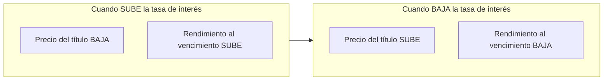
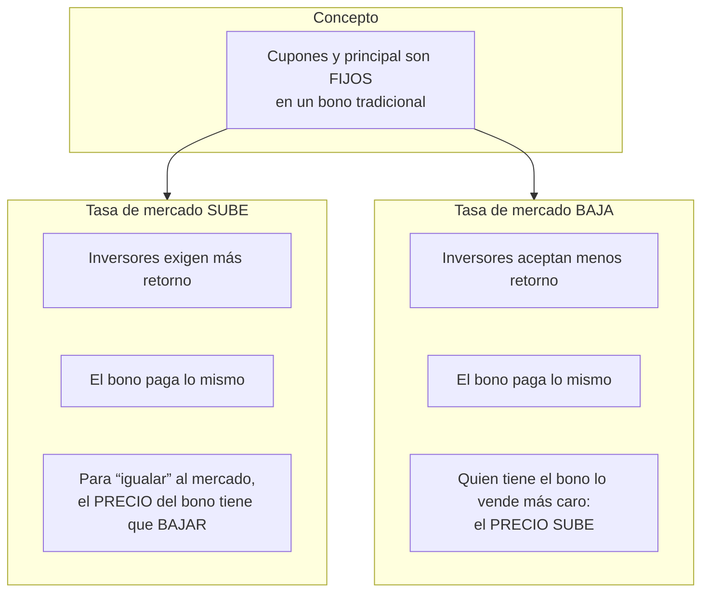
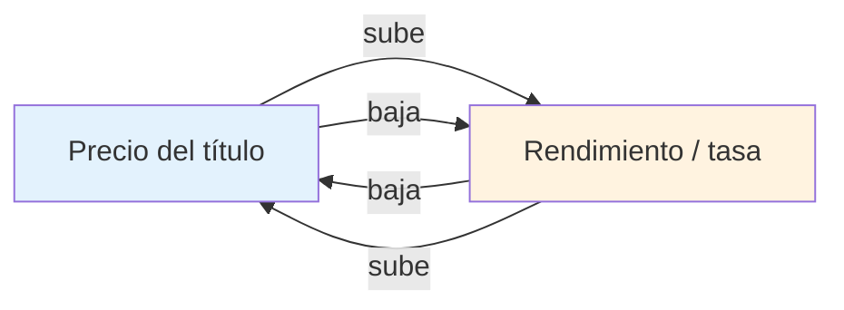
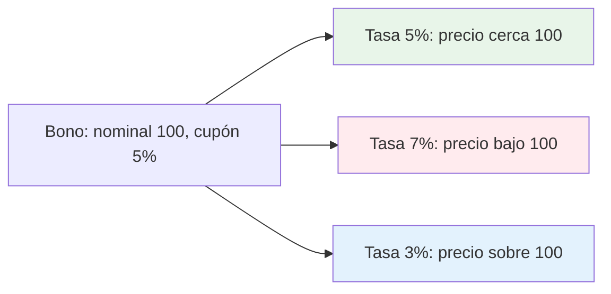

# Precio vs. rendimiento en títulos de deuda

Relación inversa entre el **precio** y el **rendimiento** (tasa de interés) de bonos y otros títulos de deuda.

---

## 1. Relación inversa (esquema general)

**Regla:** a mayor rendimiento exigido por el mercado, menor precio del bono; a menor rendimiento, mayor precio.

---

## 2. Por qué es inversa

El bono promete pagos fijos. Si las tasas suben, ese flujo fijo vale menos hoy → el precio baja y el rendimiento sube. Si las tasas bajan, el flujo fijo vale más hoy → el precio sube y el rendimiento baja.

---

## 3. Resumen visual precio ↔ rendimiento

| Precio del título | Rendimiento (tasa) |
|-------------------|---------------------|
| Sube              | Baja                |
| Baja              | Sube                |

---

## 4. Ejemplo numérico (conceptual)

- **Tasa = cupón (5%):** precio cerca del valor nominal.
- **Tasa mayor al cupón (7%):** precio por debajo del nominal (descuento).
- **Tasa menor al cupón (3%):** precio por encima del nominal (prima).

---

*Útil para interpretar movimientos en Cetes, bonos gubernamentales (M), Udibonos y cualquier título de deuda con flujos fijos.*
